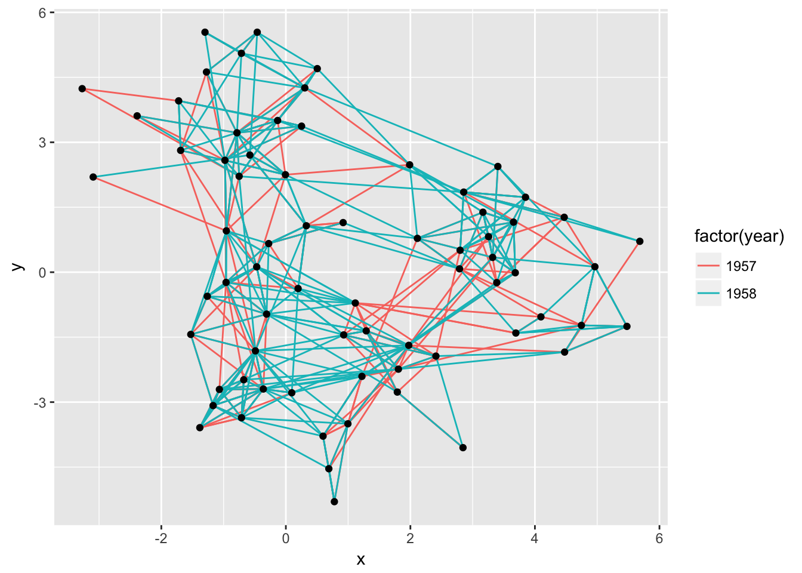
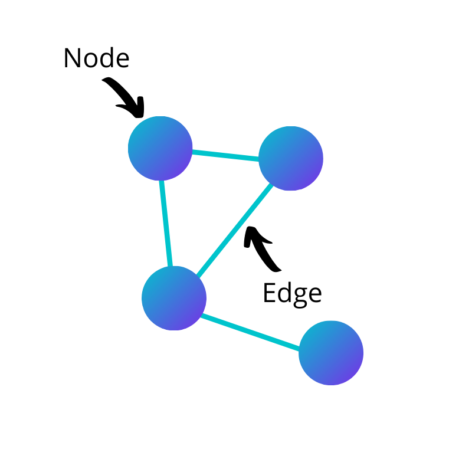
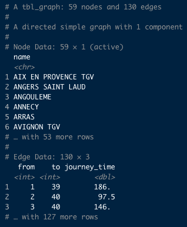
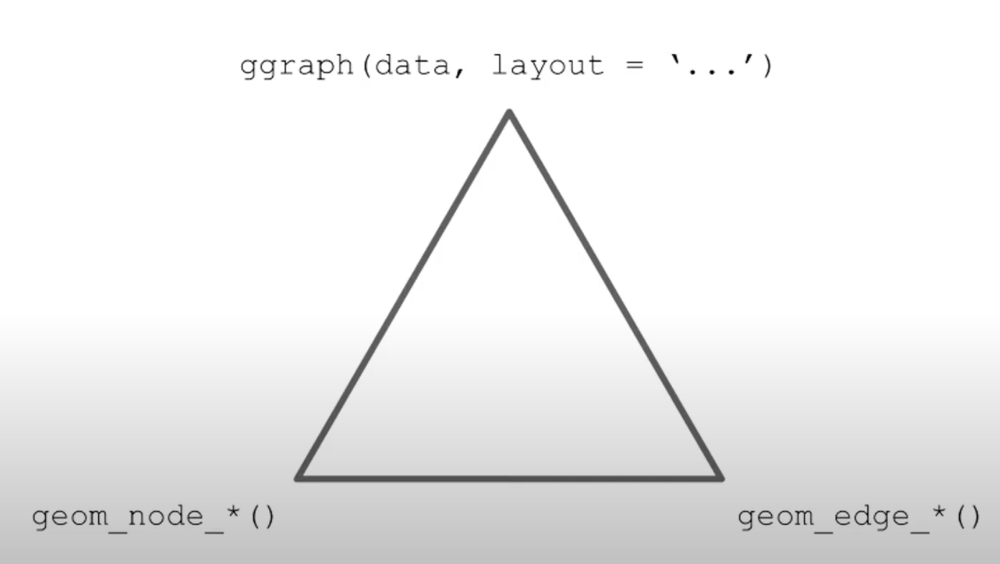
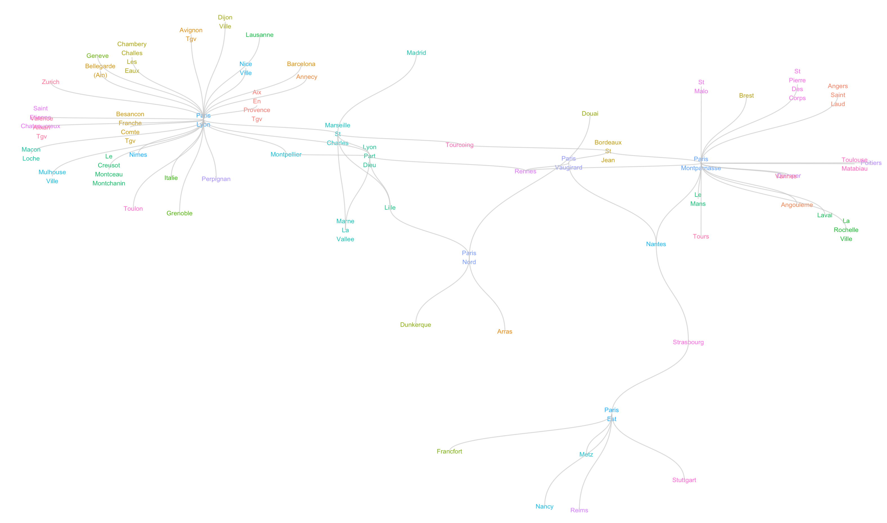
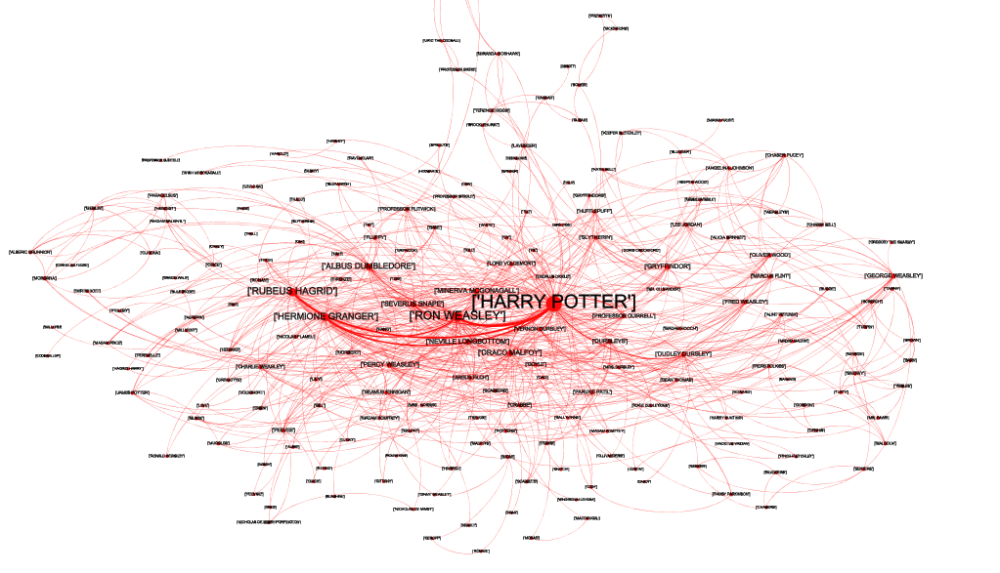

```{css, echo=FALSE} 
@media print { # print out incremental slides; see https://stackoverflow.com/questions/56373198/get-xaringan-incremental-animations-to-print-to-pdf/56374619#56374619
  .has-continuation {
    display: block !important;
  }
}
```

```{r setup, include=FALSE}
# figures formatting setup
options(htmltools.dir.version = FALSE)
library(knitr)
library(networkD3)
library(xaringan)
opts_chunk$set(
  prompt = T,
  fig.align="center", #fig.width=6, fig.height=4.5, 
  # out.width="748px", #out.length="520.75px",
  dpi=300, #fig.path='Figs/',
  cache=F, #echo=F, warning=F, message=F
  engine.opts = list(bash = "-l")
  )

## Next hook based on this SO answer: https://stackoverflow.com/a/39025054
knit_hooks$set(
  prompt = function(before, options, envir) {
    options(
      prompt = if (options$engine %in% c('sh','bash')) '$ ' else 'R> ',
      continue = if (options$engine %in% c('sh','bash')) '$ ' else '+ '
      )
})

library(tidyverse)
```


# Table of contents

<br>

1. Introduction to network plots

2. Tidygraph

3. GGraph

---
class: inverse, center, middle
name: webdata

# Introduction to network plots
<html><div style='float:left'></div><hr color='#EB811B' size=1px style="width:1000px; margin:auto;"/></html>


---
# What will we be doing the in the next fifteen minutes?

<br>
<div align="center">

</div>


---
# What are network plots?

### Network plots let you show relationships

- Network plots show interconnections between a set of entities 
- You can think of the following examples:
  - Social media: visualizing how the people you follow on Twitter have interconnections (e.g. through professions or personal interests)
  - Language: visualizing how languages and language families are interconnected to each other. Often, NLP is needed for such applications
  - Business: visualizing how certain markets or companies are interconnected, for instance through supply chains

### Why do we want to plot networks?
- To make interconnections comprehensible 
- To find new patterns or relationships among networks
- To make you look smart

---
#Nodes and edges

.pull-left[

<br>
<div align="center">

</div>

]

--

.pull-right[

### The requirements of a network plot

- In essence, you can use any type of data as long as meets the following conditions:
  - You have a data point: a node (or vertice)
  - You have a connection between the nodes: an edge (or line)
- If you want to plot a network, this means that you need to have two categories of data: (1) data on the nodes and (2) data on a meaningful distance between the nodes e.g. edges.

]

---

class: inverse, center, middle
name: webdata

# Tidygraph
<html><div style='float:left'></div><hr color='#EB811B' size=1px style="width:1000px; margin:auto;"/></html>

---

# Tidygraph: Let's turn to R!

.pull-left[

### Preparation of data

- We need to structure our data to make it ready for network plots
- For this purpose, we use the `tidygraph` package. 
- Let's see how this works in R:
<br>
<div align="left">

</div>

]

--
.pull-right[

### Nodes and edges

- Two lists are created:
  1. A node list containing a single column with the IDs or names of the nodes
  2. An edge list containing a minimum of two columns - showing the relationships between 'from' and 'to'. `Tidygraph` uses the row position as an ID number to identify the 'from' and 'to' nodes (in this case: train stations)
  
### The return of `dplyr`!
- If you want to manipulate data on the node or edge list, you can simply do so by calling the `tidygraph::activate()` function. 
- Then R knows which list you want to work with. After calling this function, you can use `dplyr` on your list!

]

---
# Example of dplyr manipulation with tidygraph

.pull-left[


```{r}
library(tidygraph)

# tbl_graph <- as_tbl_graph(df)

# tbl_graph %>%
  # activate(nodes) %>%
  # mutate(...) %>%
  # activate(edges) %>%
  # mutate(...)
```

]

--

.pull-right[

We will do this in R just a second! 

The point is: `tidygraph` provides a way to switch between the two tables and provides dplyr verbs for manipulating them

]

---
class: inverse, center, middle
name: html

# GGraph

<html><div style='float:left'></div><hr color='#EB811B' size=1px style="width:1000px; margin:auto;"/></html>


---
# GGraph

.pull-left[

### What is `ggraph`?
- `ggraph` is an extension of `ggplot2` aimed at supporting relational data structures such as networks, graphs, and trees
- The spatial position of nodes (end thereby edges) are more often defined by the graph structure through a layout function, rather than mapped to specific parameters
- This makes ggraph relatively easy to use

]

--

.pull-right[

### Once we have "tidygraphed" our data, we're good to go!
```{r}
# ggraph(data, layout = 'kk') +
  # geom_edge_link() + 
  # geom_node_point() +
  # theme_graph()
```

<br>
<div align="centre">

</div>

]

---

# A cool example
<br>
<div align="center">

</div>

---

# A second cool example (credits to Duval Alexandre)
<br>
<div align="center">

</div>


